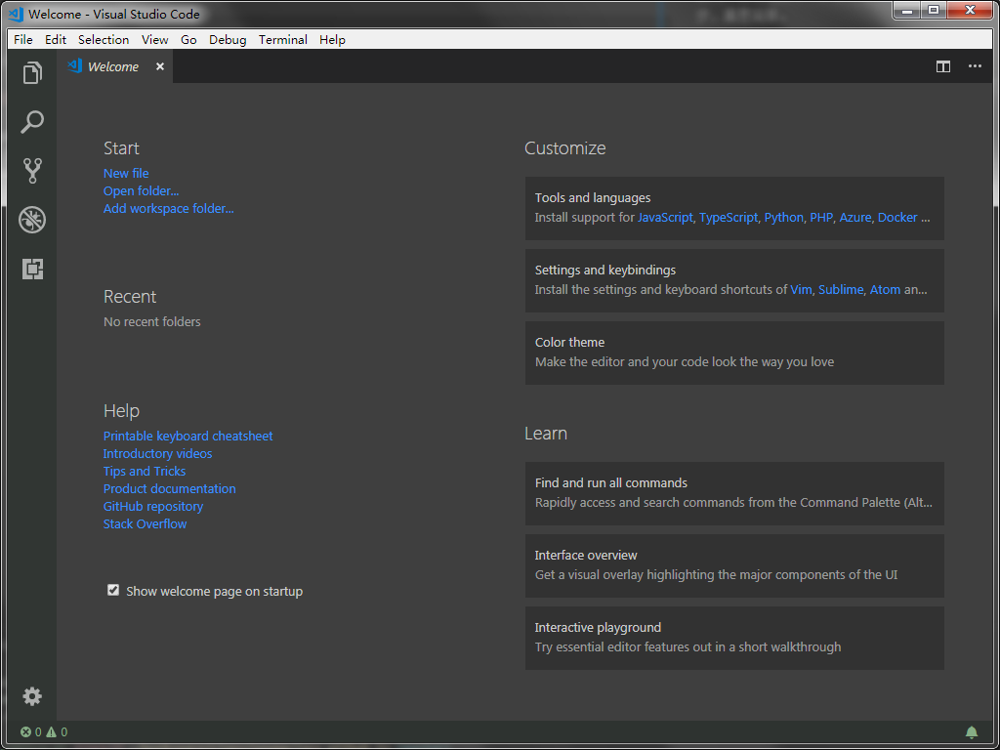
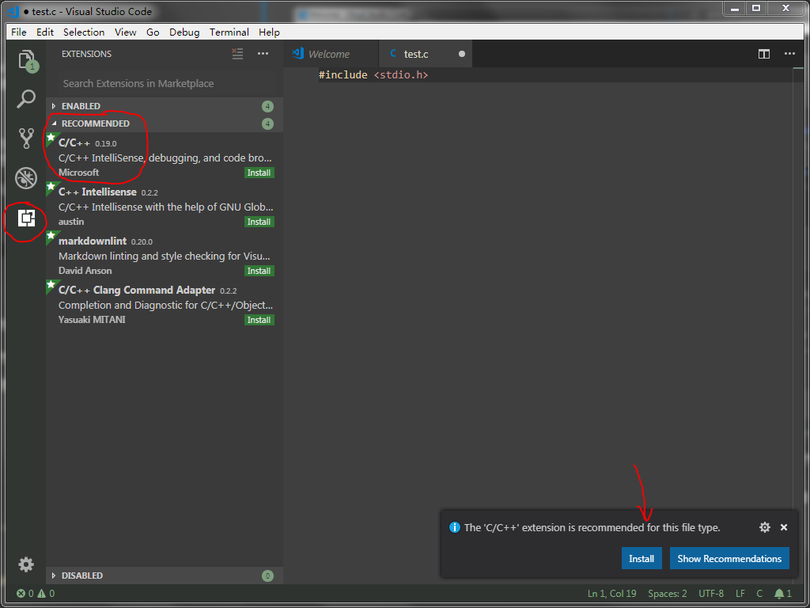
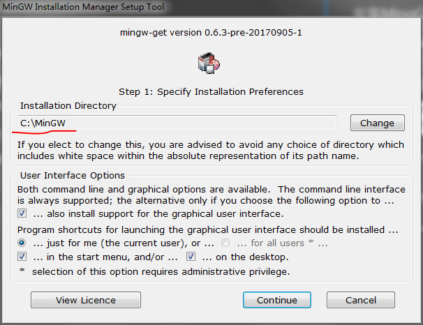
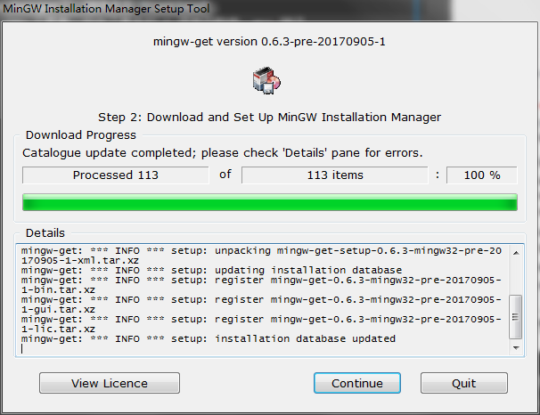
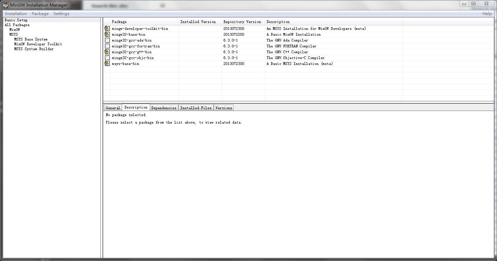
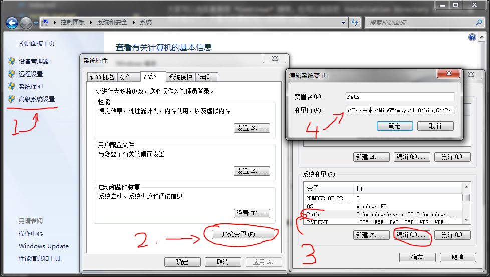

# 配置 Visual Studio Code 练习 C 语言

## 安装 VS Code

下载安装 [Visual Studio Code](https://code.visualstudio.com/) 是很简单，一路默认下一步，就安装好了。从菜单里找到应用，点击打开，就会看到下面这个欢迎界面，酷酷的。



但是，都是英文，(⊙o⊙)…
好吧，要好好学习英语。当然，我们也可以配置一下语言，目前，我觉得英文界面也没什么难的。

界面的左边是一个工具栏，上面有 5 个图标。好像很高大上的样子，先不去动它。嗯嗯，看到 *Start* 那边有一个 *New file*。好，那就先新建一个文件看看。（我们也可以通过File->New File 或者按 Ctrl-N 来新建一个文档。）

保存成 test.c，老师说可以先试试。
然后，VSCode 右下角提示我装什么 C/C++ 插件。嗯嗯，提示的东西一般不错，我们按推荐安装，点击 install。没有出来这个提示的同学不要着急，我们有两种方法来自己安装 C/C++ 插件：

- 方法1：点击左下角的齿轮形状按钮（实际上是菜单功能），点击里面出来的 Extentions 
- 方法2：直接点击最左侧 5 个按钮中最后那个方形拼图按钮

这两种方法都会打开“EXTENTIONS”卡片：




然后我们点击 *RECOMMENDED* 下面的 *C/C++* 插件的 install 按钮进行安装，于是，我们的 VSCode 就具备了 C/C++ 的基本功能。注意，这个工具是 Microsoft 提供的一个扩展，可以认为是 VSCode 最可靠的扩展之一吧。

下面我们可以继续愉快地写代码啦，写一个 hello, world 吧。

```c
#include <stdio.h>

int main() {

  printf("Hello, World!\n");
  return 0;
}
```

大家记得遵循 C 语言的新标准来写标准的代码~~

到目前为止，一切都很好。可是，可是... 我要按编译按钮了，在哪里？在哪里？

OK，VSCode 作为一个代码编辑器的工具，已经做得很好了。有好看的皮肤，有漂亮的代码，打代码开心。但是，目前 VSCode 的 C/C++ 插件并不完整，不具备编译器!

不具备编译器！:unamused: 不具备编译器！:unamused: 不具备编译器！:unamused:

泪奔一会...

其实，作为被 IDE 宠坏的一代人，我觉得我们该学习一下前辈们，在没有 IDE 的那段光荣岁月。他们都是在 Terminal 下敲指令的英雄。VSCode 给了我们 Terminal，没错，看到菜单栏的 Terminal 了吗？点击 Terminal -> New Terminal 来打开一个终端 （按下 Ctrl+` 也会打开一个 Terminal）。

在 Unix 或者 Linux 环境下，有一个编译器叫做 gcc，输入命令：

```sh
$ cd <test.c 所在目录>
$ gcc test.c
```

不会用 cd 命令的同学请看另一篇文章：Linux 基本命令（等我）。

显示：

```sh
$ gcc test.c
bash: gcc: command not found
```

好吧，还是 没有编译器! :unamused: 没有编译器！:unamused: 没有编译器！:unamused:

那就装一个呗。

## 安装 MingGW

MingGW 是在 Windows 环境下的最小 GNU 工具集。包含了基本的 C 语言函数库，gcc 编译器集合。可以点击这个[链接下载最新版本](https://osdn.net/projects/mingw/downloads/68260/mingw-get-setup.exe/)。

所以，本次配置，我们一共需要这两个安装包（根据操作系统不同，VSCode的安装包也会不一样）。


VSCodeUserSetup 这个是我们刚才安装的酷酷的编辑器。mingw-get-setup 就是我们要安装 MingGW 所需的配置包啦。装上它。

双击打开安装包，点击Install安装会出现下面的界面：



大家可以选择直接按 *Continue* 继续，也可以选择把 Installation Directory 修改到自己喜欢的路径下，不喜欢折腾的可以选择默认路径。

下一步就会安装 MinGW 的 Installation Manager了:



继续点击 *Continue*完成安装后，会跳出下面的界面（MinGW Installation Manager 界面）：



大家可以点击某一个包，然后选择 Mark for Installation 进行安装。如果不了解每一个包是什么用途，大家可以参考我的选择。

然后点击菜单栏 Installation -> Apply Changes，在弹出的窗口中点击 Apply 按钮，就会开始安装这些选中的工具啦。根据网速的不同，安装时间也不一样，进度条会显示安装进度。

装完以后，我们就可以配置 MinGW，让它工作起来了。

### MinGW 的配置

MinGW 的配置就是把其中的相关路径加入到系统的环境变量中，让我们的 Terminal 能够找到里面的 gcc 编译器。下图演示了如何加入系统环境变量：



1. 打开 控制中心 -> 系统与安全 -> 系统，点击左侧 “高级系统设置”；
2. 在弹出的标签页中单击 “环境变量”按钮，如图中数字2所标示的箭头；
3. 在弹出的对话框中选择“系统变量”框中的 Path 一行，如上图中数字3所标示的箭头，然后点击“编辑”按钮。（如果 Path 一行没有显示，可以拉动 “系统变量” 框中的滚动条，就可以看到）
4. 在新弹出的对话框中，在变量值一栏，参考已有的路径写法，把 MingGW 的路径加入其中，路径之间用 分号 (;) 分隔。我们需要加入的两个路径风别是：
   
   - "C:\MinGW\bin"
   - "C:\MinGW\msys\1.0\bin"

这里假设安装 MinGW 的时候，你选择了默认的路径，如果你修改了安装路径，对应的路径也需要修改。

最后，点击确定，关闭这些对话框。这里，我们学习了如何改动 Windows 系统的环境变量中的可执行文件路径。同时，我们的配置也完成了。


## 在 Terminal 中使用 gcc 编译器

下面，我们就可以在 Terminal 中编译程序了。使用 "Ctrl + \`" 快捷键[^shortkey] （在 Mac OS 下，所有的 Ctrl 都换成 Command 就可以了，所以是 "Command + \`"）。

[^shortkey]: 注意，这里 "Ctrl + \`" 代表同时按下 "Ctrl" 键和 "\`" 键，也可以按下 "Ctrl" 键的同时再按下 "\`" 键，中间的 + 号是不需要按的。

执行 `gcc test.c`，然后使用 `ls` 命令查看当前目录文件，可以发现，多了一个 `a.exe`：

```sh
$ gcc test.c
$ ls
a.exe  test.c
```

输入 `./a.exe` 运行，就可以发现程序运行成功了。

```sh
$ ./a.exe
Hello, World!
```

我们可以输入 gcc 编译器参数，比如，改变上面的编译命令：`gcc -o hello.exe test.c`，就会产生一个名为 `hello.exe` 的文件了。

OK，到目前为止，我们已经成功安装了 VSCode 这款编辑器软件，又安装和配置了 MinGW 这套工具，我们就可以编写程序，并在命令行里编译执行了。

更多精彩内容，请看后续笔记。

