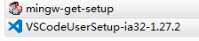

# 配置 Visual Studio Code 练习 C 语言

## 安装 VS Code

下载安装 [Visual Studio Code](https://code.visualstudio.com/) 是很简单，一路默认下一步，就安装好了。从菜单里找到应用，点击打开，就会看到下面这个欢迎界面，酷酷的。


但是，都是英文，(⊙o⊙)…
好吧，要好好学习英语。当然，我们也可以配置一下语言，目前，我觉得英文界面也没什么难的。

界面的左边是一个工具栏，上面有 5 个图标。好像很高大上的样子，先不去动它。嗯嗯，看到 *Start* 那边有一个 *New file*。好，那就先新建一个文件看看。（我们也可以通过File->New File 或者按 Ctrl-N 来新建一个文档。）

保存成 test.c，老师说可以先试试。
然后，vscode 右下角提示我装什么 C/C++ 插件。嗯嗯，提示的东西一般不错，我们按推荐安装，点击 install。没有出来这个提示的同学不要着急，我们有两种方法来自己安装 C/C++ 插件：

- 方法1：点击左下角的齿轮形状按钮（实际上是菜单功能），点击里面出来的 Extentions 
- 方法2：直接点击最左侧 5 个按钮中最后那个方形拼图按钮

这两种方法都会打开“EXTENTIONS”卡片：


然后我们点击 *RECOMMENDED* 下面的 *C/C++* 插件的 install 按钮进行安装，于是，我们的 vscode 就具备了 C/C++ 的基本功能。注意，这个工具是 Microsoft 提供的一个扩展，可以认为是 vscode 最可靠的扩展之一吧。

下面我们可以继续愉快地写代码啦，写一个 hello, world 吧。

```C
#include <stdio.h>

int main() {

  printf("Hello, World!\n");
  return 0;
}
```

大家记得遵循 C 语言的新标准来写标准的代码~~

到目前为止，一切都很好。可是，可是... 我要按编译按钮了，在哪里？在哪里？

OK，我们不要慌，vscode 作为一个代码编辑器的工具，已经做得很好了。有好看的皮肤，有漂亮的代码，打代码开心。但是，目前 vscode 的 C/C++ 插件并不完整，不具备编译器!

不具备编译器！:unamused: 不具备编译器！:unamused: 不具备编译器！:unamused:

泪奔一会...

其实，作为被 IDE 宠坏的一代人，我觉得我们该学习一下前辈们，在没有 IDE 的那段光荣岁月。他们都是在 Terminal 下敲指令的英雄。vscode 给了我们 Terminal，没错，看到菜单栏的 Terminal 了吗？点击 Terminal -> New Terminal 来打开一个终端 （按下 Ctrl-` 也会打开一个 Terminal）。

记得老师交过，在 Unix 或者 Linux 环境下，有一个编译器叫做 gcc，输入命令：

```sh
$ cd <test.c 所在目录>
$ gcc test.c
```

不会用 cd 命令的同学请看另一篇文章：Linux 基本命令（等我）。

显示：

```sh
$ gcc test.c
bash: gcc: command not found
```

好吧，还是 没有编译器! :unamused: 没有编译器！:unamused: 没有编译器！:unamused:

那就装一个呗。

## 安装MingGW

MingGW 是在 Windows 环境下的最小 GNU 工具集。包含了基本的 C 语言函数库，gcc 编译器集合。可以点击这个[链接下载最新版本](https://osdn.net/projects/mingw/downloads/68260/mingw-get-setup.exe/)。

所以，下完以后我们需要这两个安装包（根据操作系统不同，VSCode的安装包也会不一样）。



VSCodeUserSetup 这个是我们刚才安装的酷酷的编辑器。mingw-get-setup 就是我们要安装 MingGW 所需的配置包啦。装上它。

双击打开安装包，点击Install安装会出现下面的界面：


大家可以选择直接按 *Continue* 继续，也可以选择把 Installation Directory 修改到自己喜欢的路径下，不喜欢折腾的可以选择默认路径。

下一步就会安装 MinGW 的 Installation Manager了:


继续点击 *Continue*完成安装后，会跳出下面的界面（MinGW Installation Manager 界面）：


大家可以点击某一个包，然后选择 Mark for Installation 进行安装。如果不了解每一个包是什么用途，大家可以参考我的选择。

然后点击菜单栏 Installation -> Apply Changes，在弹出的窗口中点击 Apply 按钮，就会开始安装这些选中的工具啦。根据网速的不同，安装时间也不一样，进度条会显示安装进度。
