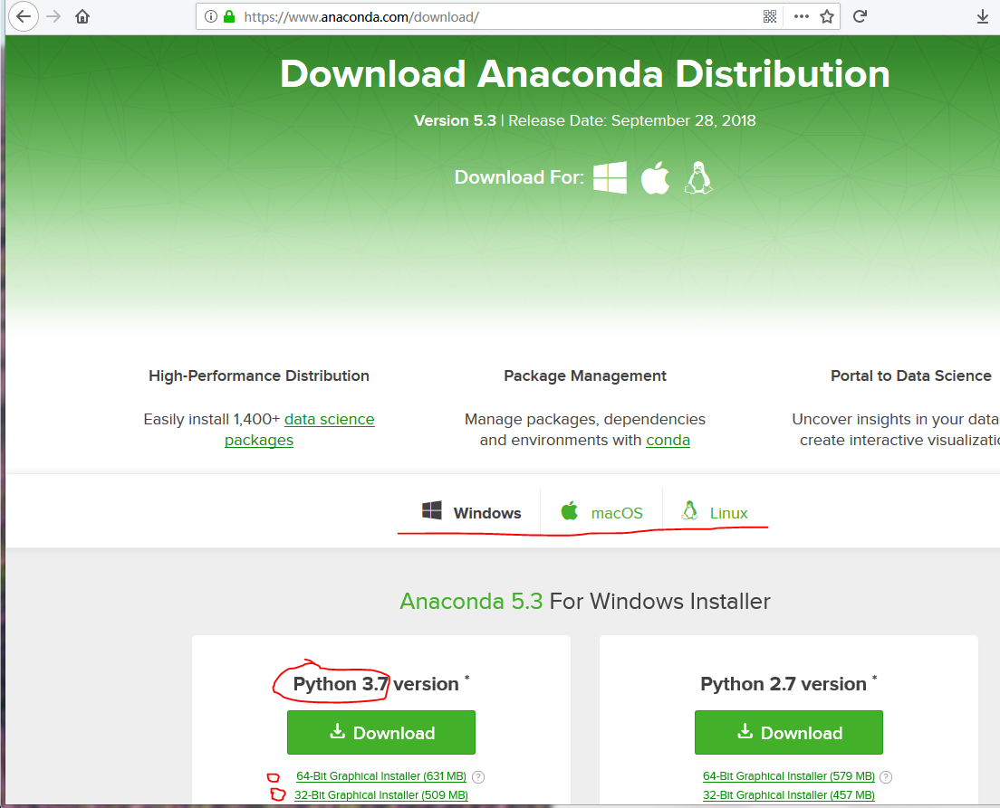

# Windows 系统安装 Python 环境

在 Windows 系统中，我们推荐使用 [anaconda](https://www.anaconda.com/) 来安装 Python 环境。anaconda 包含了 Python 解析器以外，还包含了上千的 python 包，可以说是非常全面的。如果你觉得硬盘空间吃紧，可以选择安装 [miniconda](https://conda.io/miniconda.html)。 miniconda 只会安装 Python 环境的最小系统，不会安装大量的第三方包。对于初学者，一般建议安装 anaconda，这样就减少了一开始的包的安装配置环节。

下面，我们进入安装环节。

## 下载安装 anaconda

在 [anaconda 下载页面](https://www.anaconda.com/download/)，我们需要选择操作系统和对应的 Python 版本。

一般，我们现在推荐使用 Python 3 的新语法，因此，下载 Python 3 的最新版本即可。

这里要注意选择 64-bit 版本或者 32-bit 版本。这个需要通过查看自己计算机的信息获得操作系统的信息来确定。

安装相对简单，双击打开下载的安装包运行安装程序，一路点击 next 就可以了。一般建议采用默认的设置，当然，可以在安装过程中修改安装路径（建议安装路径不要包含中文）。完整安装 anaconda 需要大约 2.3G 的空间。

## 配置 Visual Studio Code 编程环境

Visual Studio Code 提供了比较完整的 Python 支持，在扩展安装内搜索 python，安装 Microsoft 提供的 Python 安装包即可安装。

对于 Python 支持扩展包的使用，可以参考[官方的入门指导](https://code.visualstudio.com/docs/python/python-tutorial)。
